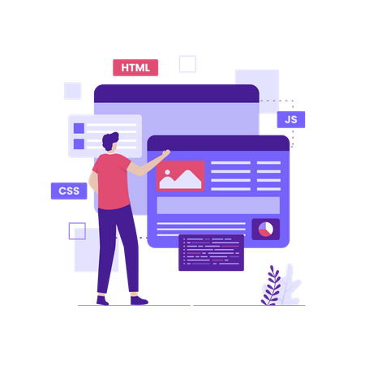

<h1 align="center">Hi 👋, I'm Dominic</h1>
<h3 align="center">A frontend developer from Germany with a passion for music :musical_note:</h3>

&nbsp;

👋 I'm Dominic and have just started my journey as a frontend developer. I'm aiming for the creation exceptional user experiences, I strive to bring ideas to life through clean and efficient code.

💻 I am currently building on a strong foundation in HTML, CSS, JavaScript and Vue.js. I'm always eager to expand my knowledge and explore the latest technologies and frameworks.

🚀 Continuously striving for growth, I believe in the power of teamwork and effective communication, as I find that collaboration fuels innovation and leads to remarkable results.

:musical_note: When I'm not coding, you can find me playing classical music in an orchestra, caring for my several plants, gaming or experimenting in the kitchen. I believe that a well-rounded life inspires creativity and keeps the mind fresh for solving complex problems.

🌍 If you're looking for a frontend developer who is passionate, detail-oriented, and dedicated, I'd love to connect and collaborate with you. Feel free to explore my projects on GitHub and reach out for any exciting opportunities or collaborations!

Happy coding! ✨

<h3 align="left">Connect with me:</h3>

